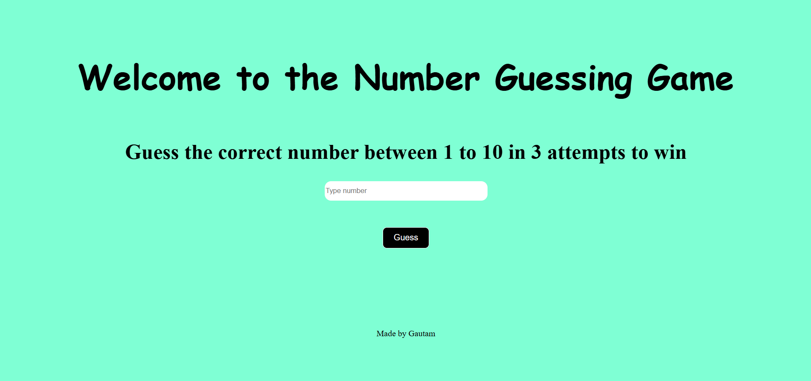

# Number-guess-game

# Overview
This Number Guessing Game is a simple and interactive game built using HTML, CSS, and JavaScript. Players are tasked with guessing a randomly generated number within a given range (e.g., 1 to 100). The game provides feedback on whether the guess is too high or too low, and players have a limited number of attempts to guess correctly. Once the correct number is guessed, the game congratulates the player and offers an option to restart.

This project is a great way to practice basic JavaScript concepts such as working with variables, handling user input, and implementing conditional statements.

# Features
Random Number Generation: The game generates a random target number each time the game starts.
Feedback System: After each guess, the game provides feedback, telling the player if the guess is too high or too low.
Limited Attempts: The player has a limited number of attempts to guess the correct number.
Game Reset: After a correct guess or when the attempts run out, the player can restart the game.

